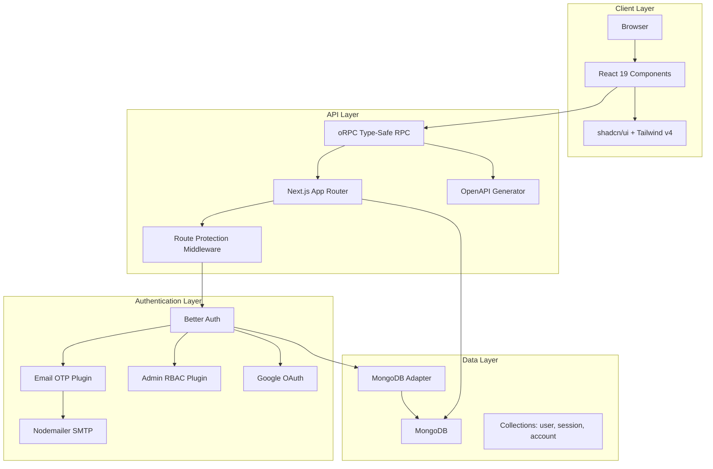

# Modern Multi-Auth, RBAC, and Beautiful UI Template in Next.js 16

<div align="center">

A modern Nextjs Template with integrated authentication, role-based access control (RBAC), and beautiful UI components.

[](https://nextjs.org/)
[](https://react.dev/)
[](https://www.typescriptlang.org/)
[](https://www.mongodb.com/)
[](https://tailwindcss.com/)

[Features](#features) • [Quick Start](#quick-start) • [Architecture](#architecture) • [Documentation](#documentation) • [Deployment](#deployment)

</div>

---

## Features

### Core Features

- 🔐 **Multi-Auth System** - Email/password, OTP, and Google OAuth authentication
- 📧 **Email System** - Beautiful HTML emails with Nodemailer (OTP, verification, welcome)
- 👥 **RBAC** - Role-based access control (user, admin, super-admin)
- 🛡️ **Admin Panel** - Complete user management with role assignment, banning, and deletion
- 🎨 **Beautiful UI** - 40+ shadcn/ui components with dark mode support
- ⚡ **Type-Safe API** - End-to-end type safety with oRPC and Zod validation
- 📚 **Interactive API Docs** - Auto-generated OpenAPI documentation
- 🗄️ **MongoDB** - Scalable database with optimized adapter pattern

### Authentication Features

- ✉️ **Email & Password** - Traditional authentication with email verification
- 🔢 **Email OTP** - Passwordless 6-digit OTP authentication
- 🔑 **Google OAuth** - Sign in with Google account
- 🔐 **Session Management** - Secure cookie-based sessions with Next.js integration
- 🚫 **User Banning** - Admin-controlled user access with custom ban reasons
- 👤 **User Impersonation** - Admin debugging feature (1-hour sessions)

### UI/UX Features

- 🌙 **Dark/Light Mode** - System-aware theme switching
- 📱 **Responsive Design** - Mobile-first responsive layouts
- 🎯 **Beautiful Forms** - Form validation with React Hook Form
- 🔔 **Toast Notifications** - User feedback with Sonner
- 🎨 **Gradient Accents** - Purple-blue gradient design system
- ♿ **Accessible** - ARIA-compliant components with Radix UI

### Developer Experience

- 🚀 **Fast Refresh** - Instant feedback with Next.js 16
- 📦 **Bun Package Manager** - Lightning-fast installs
- 🔍 **Type Safety** - Full TypeScript with strict mode
- 🧪 **Validation** - Runtime validation with Zod
- 📝 **Environment Variables** - Type-safe env vars with @t3-oss/env-nextjs
- 🎭 **Code Quality** - ESLint with Next.js config

---

## Architecture

### System Architecture



## Quick Start

**Just want to get started?** Follow these steps to run the project in 5 minutes!

### Prerequisites

- [Bun](https://bun.sh) (recommended) or Node.js 18+
- MongoDB (local or [MongoDB Atlas](https://www.mongodb.com/cloud/atlas))
- OpenSSL (for generating secrets)
- SMTP credentials (Gmail, SendGrid, etc.) - See [NODEMAILER_SETUP_GUIDE.md](implemented/NODEMAILER_SETUP_GUIDE.md)

### Installation

```bash
# Clone the repository
git clone <your-repo-url>
cd game-aggregator

# Install dependencies
bun install

# Copy environment template
cp .env.example .env

# Generate auth secret
openssl rand -base64 32
# Copy the output to .env as BETTER_AUTH_SECRET
```

### Configuration

Edit `.env` with your values:

```env
# Database
MONGODB_URI=mongodb://localhost:27017/game-aggregator
MONGODB_DB_NAME=game-aggregator

# Authentication
BETTER_AUTH_SECRET=<your-generated-secret-min-32-chars>
BETTER_AUTH_URL=http://localhost:3000

# Google OAuth (Get from: https://console.cloud.google.com/apis/credentials)
GOOGLE_CLIENT_ID=your-google-client-id
GOOGLE_CLIENT_SECRET=your-google-client-secret

# SMTP Configuration (See NODEMAILER_SETUP_GUIDE.md for setup)
SMTP_HOST=smtp.gmail.com
SMTP_PORT=587
SMTP_SECURE=false
SMTP_USER=your-email@gmail.com
SMTP_PASSWORD=your-app-password
SMTP_FROM_EMAIL=noreply@yourdomain.com
SMTP_FROM_NAME=Game Aggregator

# Environment
NODE_ENV=development
```

### Run Development Server

```bash
# Start MongoDB (if running locally)
mongod

# Start Next.js dev server
bun dev
```

Open [http://localhost:3000](http://localhost:3000) to see the app.

### Create Admin User

1. Sign up at http://localhost:3000/sign-up
2. Connect to MongoDB and promote yourself to admin:

```bash
# Using mongosh
mongosh
use game-aggregator
db.user.updateOne(
  { email: "your@email.com" },
  { $set: { role: "admin" } }
)

# Or using MongoDB Compass: Connect -> game-aggregator -> user -> Edit document
```

3. Access admin panel at http://localhost:3000/admin

---

## Documentation

### Quick Links

- 📚 **[NODEMAILER_SETUP_GUIDE.md](implemented/NODEMAILER_SETUP_GUIDE.md)** - Complete email setup guide (Gmail, SendGrid, AWS SES, etc.)
- 📚 **[CLAUDE.md](CLAUDE.md)** - Architecture and development guide for AI assistants
- 🎨 **[Component Gallery](http://localhost:3000)** - Browse all UI components when dev server is running

### API Documentation

When the dev server is running:

- **Interactive API docs**: http://localhost:3000/api
- **OpenAPI spec**: http://localhost:3000/api/openapi

---

## Tech Stack

### Frontend

- **Framework**: Next.js 16 (App Router) with React 19
- **Language**: TypeScript 5 (strict mode)
- **Styling**: Tailwind CSS v4 with next-themes
- **UI Components**: shadcn/ui (40+ components) + Radix UI
- **Forms**: React Hook Form + Zod validation
- **State Management**: React Query (server state), nuqs (URL state)

### Backend

- **API**: oRPC (type-safe RPC with automatic OpenAPI generation)
- **Authentication**: Better Auth with plugins (admin, emailOTP, nextCookies)
- **Database**: MongoDB with optimized adapter pattern
- **Email**: Nodemailer with SMTP (beautiful HTML templates)
- **Validation**: Zod schemas for type safety

### Developer Tools

- **Package Manager**: Bun (fast installs)
- **Linting**: ESLint with Next.js config
- **Environment**: @t3-oss/env-nextjs (type-safe env vars)

---

## Project Structure

```
proto/
├── app/                          # Next.js App Router
│   ├── (auth)/                   # Auth pages (sign-in, sign-up, OTP)
│   │   ├── sign-in/
│   │   ├── sign-up/
│   │   └── sign-in-otp/
│   ├── dashboard/                # User dashboard
│   ├── admin/                    # Admin panel (RBAC protected)
│   ├── api/                      # API documentation endpoints
│   │   ├── auth/[...all]/        # Better Auth API routes
│   │   └── openapi/
│   └── rpc/[[...rest]]/          # oRPC handler (dual REST/RPC)
├── components/
│   ├── auth/                     # Authentication components
│   ├── admin/                    # Admin panel components
│   │   ├── user-management.tsx
│   │   ├── user-actions.tsx
│   │   └── admin-header.tsx
│   └── ui/                       # shadcn/ui components (40+)
├── lib/
│   ├── auth.ts                   # Better Auth server config
│   ├── auth-client.ts            # Better Auth client setup
│   ├── router.ts                 # oRPC procedure definitions ⭐
│   ├── orpc.ts                   # Client-side oRPC client
│   ├── orpc.server.ts            # Server-side oRPC client (SSR)
│   ├── mongodb.ts                # MongoDB client (singleton pattern)
│   ├── email/
│   │   ├── mailer.ts             # Nodemailer transporter
│   │   └── templates.ts          # HTML email templates
│   └── utils.ts                  # Utility functions
├── hooks/                        # Custom React hooks
├── ai/                           # Google Gemini AI config
├── env.ts                        # Environment variable validation
├── proxy.ts                      # Route protection middleware
└── tailwind.config.ts            # Tailwind configuration
```

**⭐ Important**: All API procedures are defined in `lib/router.ts`

---

## Available Scripts

```bash
# Development
bun dev          # Start development server on http://localhost:3000
bun dev --turbo  # Start with Turbopack (faster)

# Production
bun build        # Build for production
bun start        # Start production server

# Code Quality
bun lint         # Run ESLint
bun lint --fix   # Fix linting issues

# Type Checking
bun type-check   # Run TypeScript compiler check
```

---

## Routes

| Route          | Access        | Description                               |
| -------------- | ------------- | ----------------------------------------- |
| `/`            | Public        | Landing page with games                   |
| `/sign-up`     | Public        | User registration with email verification |
| `/sign-in`     | Public        | Email/password or Google OAuth login      |
| `/sign-in-otp` | Public        | Passwordless OTP authentication           |
| `/dashboard`   | Authenticated | User dashboard                            |
| `/admin`       | Admin only    | Admin panel with user management          |
| `/api`         | Public        | Interactive API documentation             |
| `/api/openapi` | Public        | OpenAPI specification                     |
| `/api/auth/*`  | Public        | Better Auth endpoints                     |
| `/rpc/*`       | Mixed         | oRPC endpoints (REST/RPC hybrid)          |

---

## Games

### Current Games

#### 🪨📄✂️ Rock Paper Scissors

- Turn-based classic game with beautiful UI
- Toast notifications for game events
- Dialog-based gameplay

#### 🤠 Quick Draw Showdown

- Real-time Western duel game
- HTML5 Canvas with game loop
- Algorand blockchain staking integration
- Keyboard controls (Press A to shoot)
- State machine: waiting → ready → countdown → fire → result → staking

### Adding New Games

1. Create component in `components/games/<game-name>/index.tsx`
2. Add game state management (useState or React Query)
3. Build UI using shadcn/ui components
4. Add blockchain integration if needed
5. Add toast notifications for user feedback

---

## Admin Features

The admin panel at `/admin` provides comprehensive user management:

### User Management

- 📊 **View All Users** - Sortable table with user details
- 🔍 **Search & Filter** - Find users quickly
- 🔄 **Real-time Updates** - Refresh to see latest changes
- 📈 **User Statistics** - Role distribution and activity

### User Actions

- 🔐 **Role Assignment** - Change user roles (user, admin, super-admin)
- 🚫 **Ban Users** - Temporarily ban users with custom reasons
- ✅ **Unban Users** - Restore user access
- 🗑️ **Delete Users** - Permanently remove user accounts
- 🎭 **Impersonate Users** - Debug user issues (1-hour sessions)

### Security

- ✅ Confirmation dialogs for destructive actions
- 📝 Ban reason tracking
- 🔒 Admin-only access via RBAC middleware
- 📊 Session management and monitoring

---

## Development

### Adding API Routes with oRPC

Define procedures in `lib/router.ts`:

```typescript
import { os } from "@orpc/server";
import { z } from "zod";
import { auth } from "@/lib/auth";
import { headers } from "next/headers";

// Define a new procedure
const getUserProfile = os
  .input(z.object({ userId: z.string() }))
  .output(
    z.object({
      name: z.string(),
      email: z.string(),
      role: z.string(),
    })
  )
  .route({ method: "GET", path: "/user/profile" })
  .handler(async ({ input }) => {
    // Check authentication
    const session = await auth.api.getSession({
      headers: await headers(),
    });

    if (!session) {
      throw new Error("Unauthorized");
    }

    // Your logic here
    return {
      name: "John Doe",
      email: "john@example.com",
      role: "user",
    };
  });

// Add to router
export const router = os.router({
  hello,
  user: os.router({
    getProfile: getUserProfile,
  }),
  admin: os.router({
    getUsers,
  }),
});
```

**Use in components:**

```typescript
import { client } from "@/lib/orpc";

// Fully type-safe!
const profile = await client.user.getProfile({ userId: "123" });
```

### Adding UI Components

```bash
# Add a new shadcn/ui component
npx shadcn@latest add button
npx shadcn@latest add dialog
npx shadcn@latest add table

# Or add multiple at once
npx shadcn@latest add button dialog table form
```

### Database Access

```typescript
import clientPromise from "@/lib/mongodb";
import { env } from "@/env";

// In an API route or server component
const client = await clientPromise;
const db = client.db(env.MONGODB_DB_NAME);
const usersCollection = db.collection("user");

// Query data
const users = await usersCollection.find({}).toArray();
```

### Email Templates

All email templates are in `lib/email/templates.ts`:

```typescript
import { emailTemplates } from "@/lib/email/templates";
import { sendEmail } from "@/lib/email/mailer";

// Send a custom OTP email
await sendEmail({
  to: "user@example.com",
  subject: "Your OTP Code",
  html: emailTemplates.signInOTP("123456", 5),
});
```

Templates available:

- `signInOTP(otp, expiresInMinutes)` - Sign-in OTP
- `emailVerification(otp, expiresInMinutes)` - Email verification
- `passwordReset(otp, expiresInMinutes)` - Password reset
- `welcome(name)` - Welcome email
- `securityAlert(action, ipAddress, userAgent)` - Security notifications

---

## Deployment

### Vercel (Recommended)

1. **Push to GitHub**

   ```bash
   git add .
   git commit -m "Ready for deployment"
   git push origin main
   ```

2. **Import to Vercel**

   - Go to [vercel.com](https://vercel.com)
   - Click "New Project"
   - Import your repository

3. **Add Environment Variables**

   - Copy all variables from `.env`
   - Set `NODE_ENV=production`
   - Set `BETTER_AUTH_URL` to your Vercel domain

4. **Deploy**
   - Vercel will auto-deploy on push

### MongoDB Atlas Setup

For production, use MongoDB Atlas:

1. Create cluster at [mongodb.com/cloud/atlas](https://www.mongodb.com/cloud/atlas)
2. Get connection string
3. Update `MONGODB_URI` in environment variables
4. Whitelist Vercel IP addresses or use 0.0.0.0/0

### Environment Variables Checklist

Ensure all these are set in production:

```env
✅ MONGODB_URI - MongoDB connection string
✅ MONGODB_DB_NAME - Database name
✅ BETTER_AUTH_SECRET - Min 32 characters (openssl rand -base64 32)
✅ BETTER_AUTH_URL - Your production URL (https://yourdomain.com)
✅ GOOGLE_CLIENT_ID - Google OAuth client ID
✅ GOOGLE_CLIENT_SECRET - Google OAuth client secret
✅ SMTP_HOST - Email server host
✅ SMTP_PORT - Email server port (usually 587)
✅ SMTP_SECURE - false for port 587, true for 465
✅ SMTP_USER - SMTP username
✅ SMTP_PASSWORD - SMTP password
✅ SMTP_FROM_EMAIL - Sender email address
✅ SMTP_FROM_NAME - Sender name
✅ NODE_ENV - Set to "production"
```

### Production Checklist

Before going live:

1. ✅ Set `requireEmailVerification: true` in `lib/auth.ts`
2. ✅ Use reliable SMTP provider (SendGrid, AWS SES, not Gmail)
3. ✅ Set up SPF, DKIM, DMARC records for email domain
4. ✅ Test all authentication flows
5. ✅ Test email sending
6. ✅ Verify admin panel access control
7. ✅ Run `bun lint` and fix issues
8. ✅ Run `bun build` to verify production build
9. ✅ Test on staging environment first

---

## Addons & Integrations

### Email Providers

See [NODEMAILER_SETUP_GUIDE.md](NODEMAILER_SETUP_GUIDE.md) for detailed setup of:

- ✉️ **Gmail** - Free, easy for development (500 emails/day)
- 📧 **SendGrid** - 100 emails/day free forever
- 📨 **Mailgun** - 5,000 emails/month free for 3 months
- 📮 **AWS SES** - Very cheap ($0.10 per 1,000 emails)
- 📬 **Outlook/Office 365** - Free with Microsoft account (300/day)

### OAuth Providers

Currently supported:

- ✅ Google OAuth (configured)

To add more providers, edit `lib/auth.ts`:

```typescript
socialProviders: {
  google: { /* ... */ },
  github: {
    clientId: env.GITHUB_CLIENT_ID,
    clientSecret: env.GITHUB_CLIENT_SECRET,
  },
  // Add more providers
}
```

### AI Integration

Google Gemini AI is configured in `ai/` directory. Expand for more AI features:

```typescript
import { generateText } from "ai";
import { google } from "@ai-sdk/google";

const { text } = await generateText({
  model: google("gemini-pro"),
  prompt: "Your prompt here",
});
```

---

## Learn More

### Documentation

- [Next.js Documentation](https://nextjs.org/docs) - Next.js features and API
- [Better Auth Documentation](https://www.better-auth.com) - Authentication guides
- [shadcn/ui Documentation](https://ui.shadcn.com) - UI component library
- [oRPC Documentation](https://orpc.unnoq.com/docs/getting-started) - Type-safe RPC framework
- [MongoDB Documentation](https://www.mongodb.com/docs) - Database guides
- [Tailwind CSS](https://tailwindcss.com/docs) - Utility-first CSS

### Community

- [Next.js Discord](https://nextjs.org/discord)
- [Better Auth GitHub](https://github.com/better-auth/better-auth)
- [shadcn/ui Twitter](https://x.com/shadcn)

---

## Contributing

Contributions are welcome! Please follow these steps:

1. Fork the repository
2. Create a feature branch (`git checkout -b feature/amazing-feature`)
3. Commit your changes (`git commit -m 'Add amazing feature'`)
4. Push to the branch (`git push origin feature/amazing-feature`)
5. Open a Pull Request

---

## Troubleshooting

### Common Issues

**MongoDB Connection Error**

```bash
# Check if MongoDB is running
mongod --version

# Start MongoDB
mongod
```

**Email Not Sending**

- Check SMTP credentials in `.env`
- For Gmail, use App Password, not regular password
- See [NODEMAILER_SETUP_GUIDE.md](implemented/NODEMAILER_SETUP_GUIDE.md) for troubleshooting

**Build Errors**

```bash
# Clear cache and rebuild
rm -rf .next
bun install
bun build
```

**Type Errors**

```bash
# Regenerate types
bun run type-check
```

---

## License

This project is MIT licensed. See [LICENSE](LICENSE) file for details.

---

## Acknowledgments

Built with:

- [Next.js](https://nextjs.org/) by Vercel
- [Better Auth](https://www.better-auth.com/) for authentication
- [shadcn/ui](https://ui.shadcn.com/) for UI components
- [oRPC](https://orpc.unnoq.com/docs/getting-started) for type-safe APIs
- [Tailwind CSS](https://tailwindcss.com/) for styling
- [MongoDB](https://www.mongodb.com/) for database
- [Nodemailer](https://nodemailer.com/) for email delivery

---

<div align="center">

Made with ❤️ by the Prathamesh Chougale

[Report Bug](https://github.com/prathamesh-chougale-17/game-aggregator/issues) • [Request Feature](https://github.com/prathamesh-chougale-17/game-aggregator/issues)

</div>